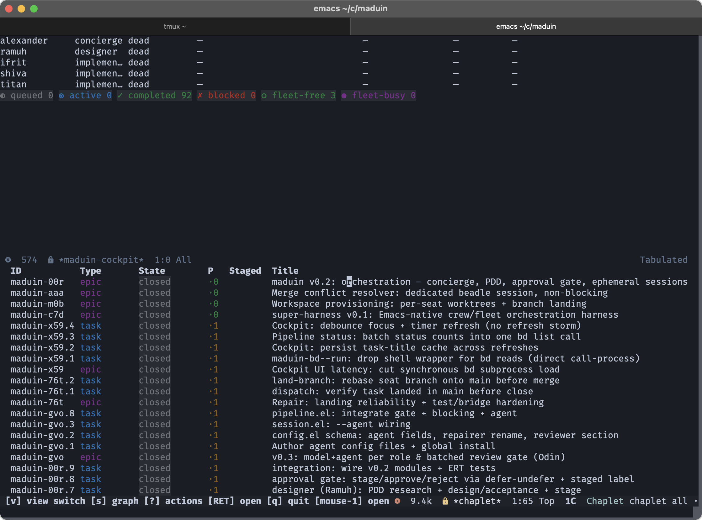

# maduin

maduin is an Emacs-native orchestrator. It wraps
[opencode](https://opencode.ai) and DeepSeek in a self-managing crew
and fleet pipeline for agentic software development.

Designer agents decompose work into tasks. Tasks live in a
[`bd` (beads)](https://github.com/gastownhall/beads) knowledge graph.
Fleet agents poll that graph, claim tasks, implement them, and close
them.

Everything runs inside Emacs. Buffers replace tmux sessions. Elisp
replaces bash. The cockpit is an Emacs dashboard.

maduin manages its own development. It dogfoods itself.



## How it works

```
concierge  →  intake & prioritize work
designer   →  design, decompose into bd tasks (dependencies tracked)
fleet      →  poll ready tasks → claim → implement → write output.md into seat worktree → close
reviewer   →  batched drift-review gate (approve/reject)
repairer   →  drift-fix on rejected review output
```

- **Demand-driven orchestration.** `maduin-start` activates the
  dispatchers. It spawns zero sessions. The run-loop polls ready `bd`
  tasks and spawns one ephemeral session per task, up to the fleet
  concurrency cap. Idle means zero running sessions.
- **Ephemeral sessions.** Each session runs one-shot
  `opencode run --format json --dir <worktree>` per task. Each seat
  has an isolated workspace.
- **Review gate.** The gate blocks auto-close until a batched
  drift-review passes. Failures route to the repairer, which retries
  up to `max-retries`.
- **Model welfare.** Seats are persistent identities with history.
  Sessions are one workday (wake → work → hand off → sleep). Agents
  close their own sessions. There is no `SIGTERM`. Agents receive
  purpose and past laurels. They have a right to refuse: escalate to
  a human instead of accepting a penalty.

## The cockpit and chaplet

`M-x maduin-cockpit-show` opens the cockpit. It displays seats,
status, and pipeline state. It auto-refreshes while visible.

The cockpit embeds the [chaplet](https://github.com/FreezingSnail/chaplet)
inbox in a lower window when chaplet is installed. chaplet is a
magit-style Emacs interface for the `bd` issue tracker. Use it to
browse beads, inspect dependency graphs, and approve or reject staged
work through `transient` menus. Inbox views re-fetch from `bd` on
focus (see `chaplet-auto-refresh`), and the embedded inbox refreshes on
explicit `r` (cockpit refresh) or `i` (inbox) commands, never on the
cockpit timer. Install chaplet from its own repository; maduin uses it
as an optional dependency.

## Requirements

- Emacs 26+
- [`opencode`](https://opencode.ai) on `PATH`
- [`bd`](https://github.com/gastownhall/beads) on `PATH`
- A `bd`-initialized project (`.beads/` directory) for task tracking
- Optional: [chaplet](https://github.com/FreezingSnail/chaplet) for
  the embedded review inbox

The core is elisp-only. There is no external runtime beyond `opencode`,
`bd`, and Emacs.

## Install

```bash
# from the repo root
./harness/install.sh            # wire maduin into Emacs (Doom-aware)
./harness/install.sh --uninstall  # remove the wiring (keeps the repo)
```

The installer appends a managed snippet to your Emacs init
(`~/.config/doom/config.el` for Doom, else `~/.emacs.d/init.el`). It
adds the harness to `load-path`, requires `maduin`, and enables
`maduin-mode`. It also symlinks the opencode agent definitions under
`harness/agents/` into `~/.config/opencode/agent/`.

Restart Emacs, or run `M-x maduin-reload`.

## Usage

| Command | Action |
|---|---|
| `M-x maduin-bootstrap` | First-time setup: create brain/handoff/logs + per-seat workspaces |
| `M-x maduin-start` | Activate dispatchers (spawns 0 sessions) |
| `M-x maduin-stop` | Drain and stop; `C-u` forces a hard stop |
| `M-x maduin-restart` | Hard-stop then start |
| `M-x maduin-status` | Refresh cockpit and show a summary |
| `M-x maduin-cockpit-show` | Open the cockpit dashboard |
| `M-x maduin-cockpit-inbox` | Jump to the embedded chaplet inbox |
| `M-x maduin-concierge` | Feed an idea to the concierge |
| `M-x maduin-concierge-dismiss` | Dismiss the concierge seat |
| `M-x maduin-designer-drop-in` | Start a designer drop-in session |
| `M-x maduin-designer-pending-tasks` | Show pending design tasks |
| `M-x maduin-reload` | Unload/reload all modules (edit-then-reload dev loop) |

Keybindings (global, via `maduin-mode`):

| Keys | Action |
|---|---|
| `C-c s s` | status (open/refresh cockpit) |
| `C-c s c` / `C-c s d` | concierge / dismiss |
| `C-c s n` / `C-c s p` | designer drop-in / pending tasks |

## Configuration

Configuration lives in `harness/config.el` as native elisp sexps. There
is no YAML and no parser dependency. The schema (v0.3) defines agent
model + seat mappings. The `crew` section has a runtime-editable `backend`
override: set it to `opencode` or `kiro` to use that provider for every
configured seat, or leave it `nil` (`unset` in the cockpit panel) to preserve
normal per-seat behavior. Effective backend precedence is: explicit crew
override > per-seat override > role backend > `opencode` default. The model
continues to come from the selected effective backend's model mapping.

- **concierge** — `slugineer-planner-concierge`
- **designer** — `slugineer-planner-designer`
- **fleet** — `slugineer-worker` (flash model; `poll-interval`,
  `max-concurrent`, `fallback` for the paid flash bucket)
- **reviewer** — `slugineer-reviewer` (`max-retries`, `esper`)
- **repairer** — `slugineer-repairer` (`max-retries`, `esper`)

Other sections: `welfare` (handoff timeout, blamelessness),
`workspaces` (path, `land-on-stop`), `harness` (name, version).

## Testing

Single entry point:

```bash
harness/check.sh                     # clean + byte-compile + ERT (173 tests)
harness/check.sh -c                  # compile only
harness/check.sh -k                  # skip clean
harness/check.sh probe probes/<f>.el # + exploratory probe test
```

Exit codes: `0` green · `1` compile error · `2` test fail · `3` probe fail ·
`5` byte-compile warnings (`STRICT=1`).

Tests are permanent ERT files co-located with source
(`harness/maduin-test.el`). Exploratory questions go in
`harness/probes/` as `probe-*` tests. Promote them to `maduin-test-*`
when they prove a real invariant.

## Layout

```
harness/
├── maduin*.el        # 16 modules (config, session, agent, pipeline, …)
├── maduin-test.el    # ERT test suite (permanent gate)
├── check.sh          # compile + test loop
├── install.sh        # Emacs wiring + agent symlinks
├── agents/           # opencode agent definitions (symlinked on install)
├── templates/        # prompt templates (crew, fleet, concierge, designer)
├── probes/           # exploratory ERT tests
└── workspaces/       # per-seat isolated worktrees (created on bootstrap)

.agents/
├── brain/            # markdown knowledge (architecture.md, conventions.md)
├── planning/maduin/  # design docs
└── handoff/          # per-seat handoff caches (runtime)

.beads/               # bd knowledge graph (task tracking)
```

## Key design notes

- **Exit codes lie.** `opencode run` exits 0 even on permission
  rejection. maduin parses NDJSON events (`step_finish.reason`,
  `tool_use.state.status`) for the real completion signal. See the
  session substrate in `maduin-session.el`.
- **Buffers, not tmux.** Each seat is an Emacs buffer named
  `*maduin/{role}-{seat}*`.
- **Shared state only via bd + brain.** Per-seat workspaces are
  isolated. Nothing else touches another seat's tree.
- **Close writes to the seat worktree.** Task summaries (`output.md`)
  land in the task's own worktree, never the main repo root.
- **Startup recovery.** The harness detects tasks left `in_progress`
  by a crashed or quit session on start. It re-dispatches them, so
  `bd ready` re-surfaces orphaned work.
- **Review UI lives in chaplet.** maduin has no approval gate. Use
  chaplet to approve (undefer) and reject staged work.

## Inspiration

Adapted from Steve Yegge's Wheelhouse (Emacs-native, ~25k elisp),
re-targeted from Claude Code MAX + Anthropic to opencode + DeepSeek.
